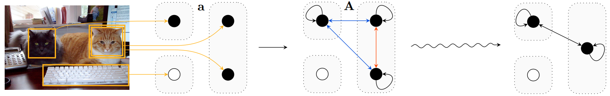

# Counting component for VQA



This is the official implementation of our ICLR 2018 paper [Learning to Count Objects in Natural Images for Visual Question Answering][0] in [PyTorch][1].
In this paper, we introduce a counting component that allows VQA models to count objects from an attention map, achieving state-of-the-art results on the number category of VQA v2.

The core module is fully contained in [`counting.py`][3].
If you want to use the counting component, that is the only file that you need.

Check out the README's in the `vqa-v2` directory for VQA v2 and `toy` directory for our toy dataset for more specific information on how to train and evaluate on these datasets.

## Single-model results on VQA v2 test-std split

As of time of writing, our accuracy on number questions is state-of-the art for single *and* ensemble models.
The accuracy on the overall category is, as far as we know, the second best among single models (see [MFH][4]), though our approach is complementary to theirs.

Yes/No | Number | Other | All
--- | --- | --- | ---
83.56 | **51.39** | 59.11 | 68.41


UPDATE: With this year's VQA Challenge, our number results are no longer SotA.
However, [Bilinear Attention Networks][5] [[code]][6] use this counting component with their improved attention model and get 54.04% on the number category, which is the new SotA on the number category.
This validates our claim that a better attention model should lead to further improvements in counting through our counting module.


## BibTeX entry
```
@InProceedings{zhang2018vqacount,
  author    = {Yan Zhang and Jonathon Hare and Adam Pr\"ugel-Bennett},
  title     = {Learning to Count Objects in Natural Images for Visual Question Answering},
  booktitle = {International Conference on Learning Representations},
  year      = {2018},
  eprint    = {1802.05766},
  url       = {https://openreview.net/forum?id=B12Js_yRb},
}
```

[0]: https://openreview.net/forum?id=B12Js_yRb
[1]: https://github.com/pytorch/pytorch
[2]: http://visualqa.org/
[3]: https://github.com/Cyanogenoid/vqa-counting/blob/master/vqa-v2/counting.py
[4]: https://github.com/yuzcccc/vqa-mfb
[5]: https://arxiv.org/abs/1805.07932
[6]: https://github.com/jnhwkim/ban-vqa
